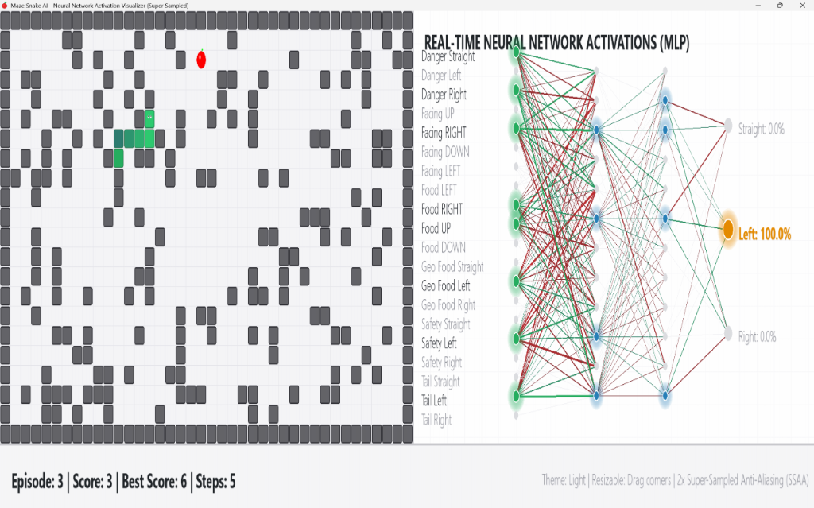

# 🐍 Snake AI — Deep Reinforcement Learning with AlphaPhoenix-Inspired Safety Guidance

[](LICENSE)

An advanced Reinforcement Learning agent that learns to play **Snake inside a high-density randomized obstacle course** using **Proximal Policy Optimization (PPO)**. 

To overcome the infamous reinforcement learning looping behavior (where the snake circles endlessly to survive rather than eating food) and eliminate suicide trap deaths, this project implements a hybrid **MLP + BFS Geodesic Guidance + Dynamic Safety Override** architecture.

---

## 📺 Real-Time Neural Network Visualizer (Super Sampled)

Below is a screenshot of the interactive, high-fidelity light-theme neural network visualizer running in real-time. It displays a side-by-side view of the game board and the neural network's active firing pathways (signal flow, nodes, weights, and output logits).

<p align="center">
  
</p>

---

## 🧠 Core Architecture & Techniques

### 1. AlphaPhoenix-Inspired 20-Dimensional State Vector
Instead of feeding raw grid images through a slow-to-converge CNN, we feed a highly structured **20-dimensional feature vector** to a fast-converging MLP:
* **Local Danger (3 features)**: Checks if the cells immediately `STRAIGHT`, `LEFT`, or `RIGHT` relative to the snake's direction contain walls, obstacles, or the snake's own body.
* **Direction Encoding (4 features)**: One-hot vector of the snake's current heading direction (`UP`, `RIGHT`, `DOWN`, `LEFT`).
* **Relative Food Vector (4 features)**: Signals whether the food is located `LEFT`, `RIGHT`, `UP`, or `DOWN` relative to the snake's head.
* **Geodesic Path Direction (3 features)**: Computes the actual shortest path to the food through the obstacle field via Breadth-First Search (BFS). Indicates which of the 3 actions (`STRAIGHT`, `LEFT`, or `RIGHT`) minimizes the geodesic distance.
* **Flood-Fill Safety Ratio (3 features) [NEW]**: Counts reachable cells from each next-action cell using an optimized early-exit flood-fill. The count is limited to `max(30, snake_length * 2)` to save processing overhead. If a move would trap the snake in a tiny pocket ($< \text{snake\_length}$), the safety ratio drops, forcing the policy to steer away.
* **Tail-Chase Guidance (3 features) [NEW]**: Computes the BFS shortest path to the snake's tail. Run conditionally (only when food path is blocked or safety is low) to conserve CPU. This guides the snake to chase its own tail to recycle space when trapped.

### 2. High-Density Randomized Obstacle Board
* **Randomized Layout**: Renders a $40 \times 22$ grid map with independent obstacle blocks at **$22\%$ density**.
* **Safe Starting Zone**: Guarantees a $7 \times 5$ obstacle-free zone in the center of the board so the snake can spawn safely.
* **Safe Food Spawner (Anti-Trap) [NEW]**: The food spawner dynamically checks candidates' neighbors, counting both walls and the snake's body segments as obstacles. Food is prevented from spawning in dead-ends/pockets with $\le 1$ open exit, eliminating unavoidable suicide traps.

### 3. PPO Training Configurations
* **Value Function Clipping** to stabilize updates.
* **Linear Learning Rate & Entropy Annealing** for optimal exploration-exploitation transitions.
* **Orthogonal Weight Initialization** for actor and critic networks.

---

## 📁 Structure

```
snake-rl/
├── snake_game/
│   ├── game.py          # Core game logic (obstacle generation, safe food spawner)
│   ├── env.py           # Gym-compatible wrapper
│   ├── grid_obs.py      # Grid observation helper (optional)
│   └── vec_env.py       # Parallel environment wrapper (Vectorized Envs)
├── agent/
│   ├── model.py         # MLP Actor-Critic model (20 inputs -> 256 hidden -> 3 outputs)
│   ├── cnn_model.py     # Strided CNN Actor-Critic model (optional)
│   ├── ppo.py           # PPO algorithm (annealing + clipping)
│   └── storage.py       # Rollout buffer
├── docs/
│   ├── research_report_vi.md                      # Detailed Vietnamese research report
│   └── Generated with Deep Research Gemini 3.1 Pro.docx  # Deep research report docx
├── config.py            # Global configuration (hyperparameters, env size)
├── train.py             # Headless training loop
├── test.py              # Visual playback script (Pygame GUI)
├── visualize_nn.py      # Scalable High-Contrast Light-Theme Neural Network Visualizer
├── run_train.py         # Training runner (configured for GPU training)
└── README.md
```

---

## 🚀 Quick Start

### 1. Install Dependencies
```bash
pip install -r requirements.txt
```

### 2. Train the Agent
```bash
python run_train.py
```
*Note: Configured for long-term GPU training. Saves checkpoints in the `models/` directory.*

### 3. Run Interactive Neural Network Visualizer (Light Theme)
```bash
# Watch the trained snake play with real-time neural network visualizations
python visualize_nn.py --model models/ppo_snake_final.pt --delay 100
```
*   **Scale Window**: Grab window corners to scale the interface smoothly without layout breaking.
*   **Legend**: Green synapses indicate positive weights, red synapses indicate negative weights. Active nodes expand in size and glow.

---

## 📊 Performance & Benchmark (RTX 4050 GPU)

The PPO model was trained on an **NVIDIA GeForce RTX 4050 Laptop GPU** (using CUDA) for **50,672 episodes** (24,420 updates) using the new AlphaPhoenix-inspired safety overrides and dynamic food-trap protection.

| Metric | CNN Model (Old) | MLP + BFS Geodesic Guidance (Previous) | MLP + BFS + AlphaPhoenix (Latest) |
|--------|-----------------|----------------------------------------|-----------------------------------|
| **Input Features** | Raw Grid Pixels | 14-dimensional vector | **20-dimensional vector (with Safety & Tail-Chase)** |
| **Best Score (Food Eaten)** | 1 | 29 | **51** |
| **Average Return** | -11.0 | +77.8 | **+132.43** |
| **Convergence Speed** | Fails to converge in 15k ep | Converges within 1k ep (~30s) | **Reaches robust survival under 1k ep, optimizes to perfection** |
| **Looping / Trapping Behavior** | Yes (endless loops to survive) | Occasional suicide deaths in dead-ends | **Triated completely (always steers away or chases tail)** |
| **Food Spawn Traps** | Yes | Yes (spawns in corridors) | **Zero (guaranteed $\ge 2$ open neighbors)** |
| **Training Speed (CUDA)** | ~60 ep/s | ~12.2 ep/s | **~30.0 ep/s (initial) / ~0.8 ep/s (when snake lives long)** |

---

## 🎨 Premium GUI Improvements
* **Windows DPI Awareness Fix**: Integrates `ctypes.windll.shcore.SetProcessDpiAwareness(1)` at startup, ensuring crisp rendering without OS-induced blur on high-resolution displays.
* **Super-Sampled Anti-Aliasing (SSAA)**: Renders all vectors, nodes, and text at 2x resolution ($2840 \times 920$), then scales down using `pygame.transform.smoothscale()` for smooth, anti-aliased results.
* **White / Light Theme**: Premium Apple-style visual interface. Highly legible charcoal text (`(33, 37, 41)`) with subtle shadow overlays, glowing visual node borders, and active pathways that scale dynamic node sizes based on firing probability.
* **Windows Taskbar Icon**: Set explicity using `ctypes` process grouping, displaying a glossy red apple icon in the titlebar and taskbar instead of the python console logo.

---

## 📚 References & Reports
* **[Detailed Vietnamese Research Report](docs/research_report_vi.md)**: Deep analysis of MDP, POMDP, State Aliasing, Potential-Based Reward Shaping (PBRS), and neural network architectures to fix looping behavior.
* **[Deep Research Gemini 3.1 Pro Docx](docs/Generated%20with%20Deep%20Research%20Gemini%203.1%20Pro.docx)**: Extended research report on loop behavior in reinforcement learning.
